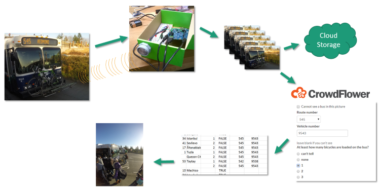
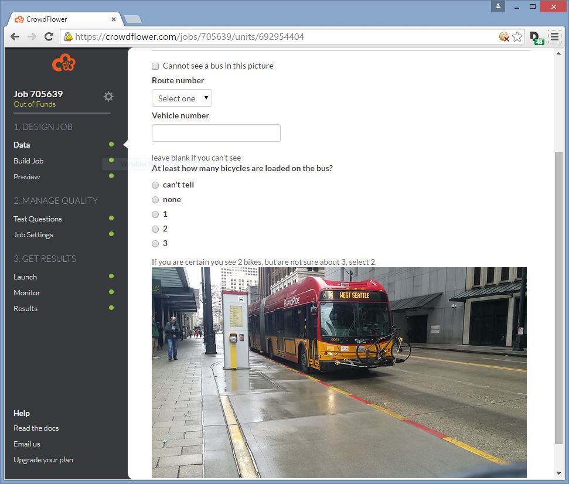

# bikeraxx
## Low cost sensing of bike rack use on buses

King County Metro and Sound Transit buses provide bicycle racks on the front of each vehicle. Each rack holds 2-3 bikes.
At certain stops, the bike rack use is so popular that the rack space is full and cyclists have to wait for the next bus, if there's space.

This project's solves two problems. First, the agencies have no quantitative data about how often and how much the bike racks are used. Second, citizens wanting to use the bike racks benefit from having advance warning if the bike rack on their soon-to-arrive bus is full. With this information, commuters can make better informed decisions such as going to another stop, waiting and getting coffee, or riding a different route.

To sense bike rack use, one could deploy sensors on every bus, and relay the data back to some central system. However, this is very costly. Our solution places inexpensive hardware on top of bus stop signs and/or shelters. The system has a sonar sensor that knows when the bus approaches. This triggers an Android phone to take a set of pictures which are relayed to the cloud. Shortly afterward, the pictures are sent to crowd workers who are paid a few cents to label key information: route number, vehicle number, and how many bikes are on the bus. This schematized data is then relayed back to the cloud, where it can be combined with real time arrival apps like [OneBusAway](http://onebusaway.org) or analyzed offline for agency reporting.

The crowd work component of the system is intended to generate data that can be used for machine learning (AI) that will be able to process the image and compute the data on its own without human intervention. 

You can see a [video of us recording data on 3rd Avenue](https://www.youtube.com/watch?v=u7hVk-xnSJ4). The device worked, producing [photos like this](https://bikeraxx.blob.core.windows.net/images/20150322_133012.JPG) that were presented to crowd workers with an interface like the following:

This application was developed during March 20-22 for the [Hack the Commute](http://hackthecommute.seattle.gov).

## Team Members

Our team is comprised of:

- [Max Golub](https://github.com/mgolub2), UW
- Alex Gingras, UW
- [Dan Liebling](http://liebling.org), Microsoft Research
- [Rob Smith](https://github.com/robbiesmith), Amazon

## Standing on the shoulders of giants

There are several "moving parts" in this hack: hardware and platforms that enable our solution:

- [Maxbotix MB7060](http://www.maxbotix.com/Ultrasonic_Sensors/MB7060.htm) outdoor high precision ultrasonic rangefinder
- [Intel Edison](http://www.intel.com/content/www/us/en/do-it-yourself/edison.html) integrated system used for prototyping electronics hardware
- [Microsoft Azure](http://azure.microsoft.com) cloud platform, used to store images and host our Web site
- [Crowdflower](http://www.crowdflower.com) microtasking platform, where crowd workers label the images taken by the system
* [OpenCV](http://opencv.org/) computer vision libraries used for feature recognition
* [AlchemyAPI](http://www.alchemyapi.com/) AI resource used for image recognition
